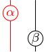
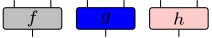
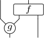

Satex is a [string diagram](https://en.wikipedia.org/wiki/String_diagram) generator for LaTeX. It takes as input a formula such as

```
(1 * delta) * (mu * 1)
```

(appropriately written in the LaTeX file) and produces a diagram such as


generated using TikZ.

In order to get started, you can have a look at

- [the manual](https://smimram.github.io/satex/satex.pdf)
- [the examples](https://smimram.github.io/satex/examples.pdf)

In case you have a problem, please [file a bug report](https://github.com/smimram/satex/issues).

This is inspired from [catex](https://plmlab.math.cnrs.fr/guiraud/catex/) (when the sources were not available).

# Installation

Installing with [opam](https://opam.ocaml.org/) is as simple as

```bash
opam install satex
```

If you are on mac, you can first install opam with [brew](https://brew.sh/) with

```bash
brew install opam
opam init
```

# General usage

In order to use satex in your LaTeX file, you should first include the style file:

```
\usepackage{satex}
```

You should then declare the operators you want to use in the format

```
\deftwocell[options]{name : m -> n}
```

which declares an operator named `name` with `m` inputs and `n` outputs. The options in `options` allow changing the way the operator is displayed and so on. For instance,

```
\deftwocell[triangle]{mu : 2 -> 1}
```

will declare the following operator:


One can then generate diagrams by using commands of the form

```
\twocell{expr}
```

where `expr` is a categorical expression involving operators and identities. The identity on _n_ wires is simply written as the corresponding number and compositions are noted `*`: toplevel compositions are vertical ones and those inside parenthesis are horizontal. For instance

```
\twocell{(2 * mu) * (1 * mu) * mu}
```

will typeset


A run of `pdflatex` on your file, say `file.tex`, will generate a file named `file.satex`. You should then run

```
satex file.satex
```

which will generate a file `file.satix` containing the generated TikZ figures, which are automatically included in the next run of `pdflatex` on your file.

# Options for operators

## Shapes

Various shapes are available for operators:

- `circle` (default one): 
- `triangle`: 
- `rectangle`: 
- `lefthalfcircle` / `righthalfcircle`:  / 
- `mergeleft` / `mergeright`:  / 
- `cup` / `cap`:  / 
- `sqcup` / `sqcap`:  / 
- `crossing` / `crossingl` / `crossingr`:  /  / 
- `braid` / `braidl`:  / 
- `crossing'` / `braid'`:   / 
- `dots` (horizontal dots between two wires): 
- `blank`: 

## Variants of shapes

The primed variants `crossingl'` / `crossingr'` and `braidl'` / `braidr'` behave as above but leave the wires straight before and after the crossing. The shapes `id` (plain identity wires) and `none` (wires meeting at the center, with no node decoration) are also available, although wires are more commonly written using the numeric identity notation.

Caps and cups can have any (even) number of wires: the arcs are then nested. For instance `(0 -> 4)[cap]` typesets


The `circle` option makes the arcs perfect half-circles and the `arrow` option adds an orientation in the middle of the arc:

 / 

## Dimension

The dimension of the shape can be adjusted with the `labelwidth` and `labelheight` parameters, or both at once with `labelsize` (also spelled `size` or `ls`).

## Labels on operators

Labels are indicated between double quotes. For instance

```
\deftwocell[triangle,"\mu"]{mu : 2 -> 1}
```

typesets


Their vertical position can be adjusted with the `position` parameter (between `0` and `1`).

## Colors on operators

The color of operators and wires can be changed with `color=...` options, e.g.

```
\twocell{((1->1)["\alpha",color=red] * 1) * (1[color=red] * (1->1)["\beta"])}
```

typesets



Filling colors can also be specified with `fill=color` option, e.g.

```
\twocell{((2->1)[r,fill=lightgray,"f"] * (2->1)[r,fill=blue,"g"] * (2 -> 1)[r,fill="red!20!white","h"])
```

typesets



The color of the border of the node alone can be set with `bordercolor=color`.

Operators can be hatched by passing the `hatch` option, e.g.

```
\twocell{(1->1)[r,hatched]}
```

typesets


In order for this to work, you need to add `\usetikzlibrary{patterns}` in the preamble of your latex file.

## Labels on wires

The special operator `label` allows adding labels to wires. The option `d` or `u` indicates whether the labels should be put down or up, and the above syntax is used for labels. For instance

```
\twocell{label[d,"x","y"] * mu * label[u,"z"]}
```

typesets


## Inline operators

You can use operators which have not been declared beforehand: the syntax is `(m -> n)[options]` to use an operator with `m` inputs, `n` outputs and given options. For instance,

```
(1 * (1 -> 2)[rectangle,"f"]) * ((2 -> 1)["g"] * 1)
```

typesets



## Spacing

Horizontal space can be adjusted by using operators of the form `space2.8` which adds an horizontal space of `2.8` (formally this is an operator with no inputs and outputs).

Vertical space can be adjusted by changing the `height` parameter of one of the operators on the line.

# Program options

## Horizontal layout

You can have a horizontal layout by passing the `--horizontal` option to `satex`.

# latexmk

If you use `latexmk` and want it to automatically call `satex` to generate `.satix` files, you can add the following `.latexmkrc` in your project folder:

```
# NOTE: the .satix file is input via \IfFileExists so that latexmk does not
# detect it as a dependency, we use a fake pdflatex in order to register it.

$pdflatex = 'internal satex_latex %R %Z pdflatex %O %S';

sub satex_latex {
    my $root = shift;
    my $dir_string = shift;
    my $ret = system @_;
    my $satex = $dir_string . $root . '.satex';
    my $satix = $dir_string . $root . '.satix';
    if ( (-e $satex) && (-s $satex) ) {
        rdb_ensure_file( $rule, $satix );
    }
    return $ret;
}

add_cus_dep('satex', 'satix', 0, 'generate_satix');

sub generate_satix {
    my ($base) = @_;
    return system("satex \"$base.satex\"");
}

push @generated_exts, 'satex';
push @generated_exts, 'satix';
```
